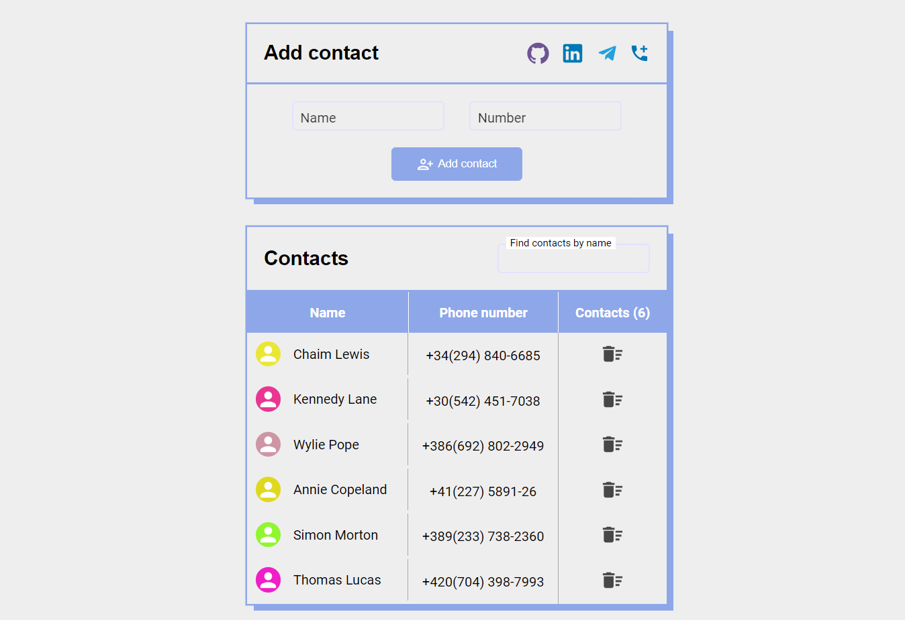

# Contact list - list of your contacts in real time

The application allows you to add, delete and filter contacts. Contacts are saved after page reload.

## Tech Stack

1. Frontend: Typescript, Material-UI, Formik and Yup,React, styled-components, local storage.
2. Project made with Material-UI components.
3. Adaptive layout.

### Local launch of the program on your device

1. Download repository and install dependencies -> npm install
2. Launch the application -> npm start.

